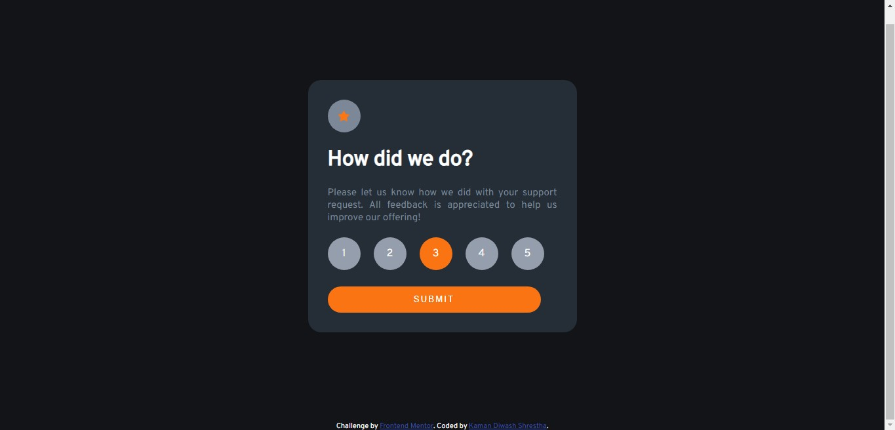

# Frontend Mentor - Interactive rating component solution

This is a solution to the [Interactive rating component challenge on Frontend Mentor](https://www.frontendmentor.io/challenges/interactive-rating-component-koxpeBUmI). Frontend Mentor challenges help you improve your coding skills by building realistic projects. 

## Table of contents

- [Overview](#overview)
  - [The challenge](#the-challenge)
  - [Screenshot](#screenshot)
  - [Links](#links)
- [My process](#my-process)
  - [Built with](#built-with)
  - [What I learned](#what-i-learned)
  - [Continued development](#continued-development)
  - [Useful resources](#useful-resources)
- [Author](#author)

**Note: Delete this note and update the table of contents based on what sections you keep.**

## Overview
Using the HTML, CSS, JavaScript, a interactive rating page is built. In the webpage, the user can select their desired rating. User can also see their clicked rating through the change in background colour of the ratings. After choosing the ratings and clicking on the Submit button, a page with thank you card would be displayed where their chosen rating would also appear. 
### The challenge

Users should be able to:

- View the optimal layout for the app depending on their device's screen size
- See hover states for all interactive elements on the page
- Select and submit a number rating
- See the "Thank you" card state after submitting a rating

### Screenshot




### Links

- Solution URL: [Github Repository](https://github.com/FrontEnd-Development-Learning/interactive-rating)
- Live Site URL: [Live Site](https://frontend-development-learning.github.io/interactive-rating/)

## My process
  Using HTML, the page is structured. div tag is used for specifying and structuring different part of the webpages. Inside these div element, child elements are denoted using different tags such as p, h1, img and such. 
  After structuring the page, the page is styled using CSS. Using flex value in display property, the div containing the content is centered. The height of parent element of the content div is assigned 100% of the screen using CSS. Then, inside the content div, all the required contents are structured and styled. For making the page more interactive, hover effect is added over the ratings and on clicking the ratings, their background colour would change, which was done by using JQuery. Flex box property along with text-align, justify-content, align-items etc are used for centering the ratings and enclosing inside a div element. 
  
  For making the pages more interactive, functionalities are added using JS. After clicking the Submit button, whole content div would be cleared and new content would be built using DOM Manipulation in JS. In JS, using createElement('tag-name') and appendChild(element), the HTML elements are built, then text is written inside it and afterwards it is appended to content div. addEventListener method with click argument is used for taking the rating chosen by the user and appended it into the DOM. 

### Built with

- Semantic HTML5 markup
- CSS custom properties
- Flexbox
- JQuery

### What I learned

For making the pages more interactive, I chose to change the background colour of the ratings after a specific rating has been clicked. So while researching about changing the content of the div after clicking the button, I found out about the JQuery which is a library of JS which eases the event handling, DOM manipulation and so on. So from the research I found that there are numerous methods in JQuery which needs to be linked using script tag in the HTML file. 
For changing the background colour, following code is used. 

```html
<script>
  // 
  $(".ratings").on('click', '.circleRating', ()=>{
    $('.circleRating').removeClass('circleSelected');
    $(this).addClass('circleSelected');
  } )
</script>
```
I also found that for adding div in the form of circle, following code need to be written
```css
.circle{
  height: 50px;
  width: 50px;
  border-radius: 100%;
}
```

For clearing the content of the content div after the click of the button, following code is written:
```js
const clearContent = () => {
  // replaces all the children in the parent element of id content
  document.getElementById('content').replaceChildren();
}
```

Furthermore, I got to know about the use of landmark elements for specifying different sections of the webpage including main, article, footer, address and such. 
```html
<main>
  <header>This is the header of the main section </header>
  This is the main section
  <article>
    <header> This is the heading of the article </header>
    <p> This is the content in the article </p>
  </article>
</main>
<footer>
  This is the footer sectionn of the block
</footer>
```

I also learnt about using media queries to make my page more responsive, while using media queries, the type of media queries need to be specified including screen, print and text. Default value of the media type is all. Afterwards the features are added in the media. 
```css
/* For styling the content of the page only when the minimum width is 400px */
@media (min-width: 400px){
  /* CSS styling code */
}
``` 


### Continued development

Further more, I want to know more about JQuery and how does it work, its future prospects and its alternatives. 

## Author

- Website - [Kaman Diwash Shrestha](https://github.com/KamanDShrestha)
- Frontend Mentor - [@KamanDShrestha](https://www.frontendmentor.io/profile/KamanDShrestha)
